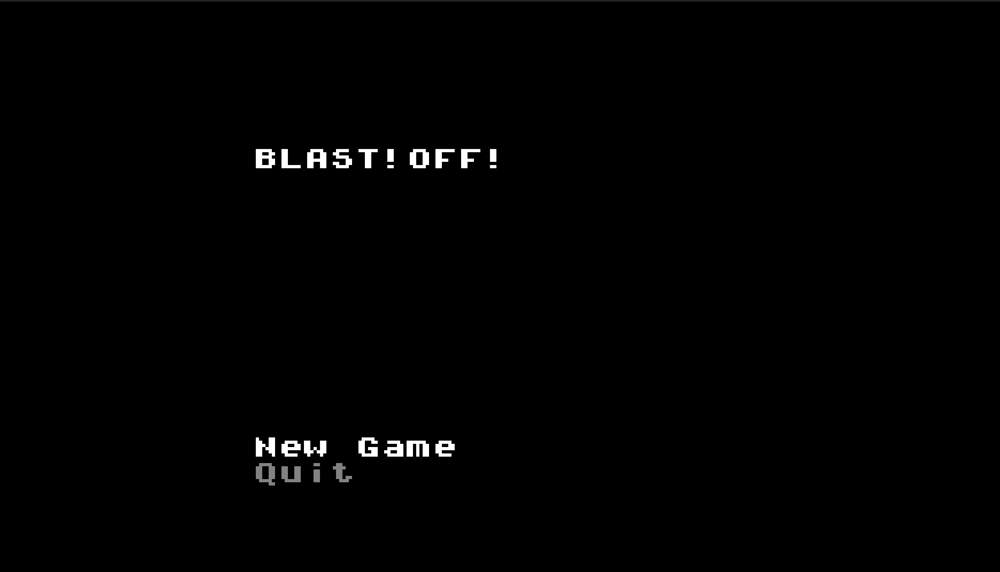
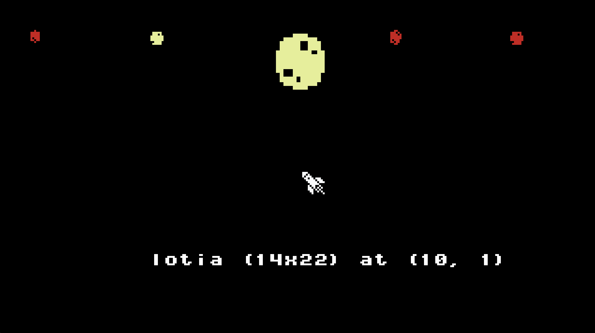
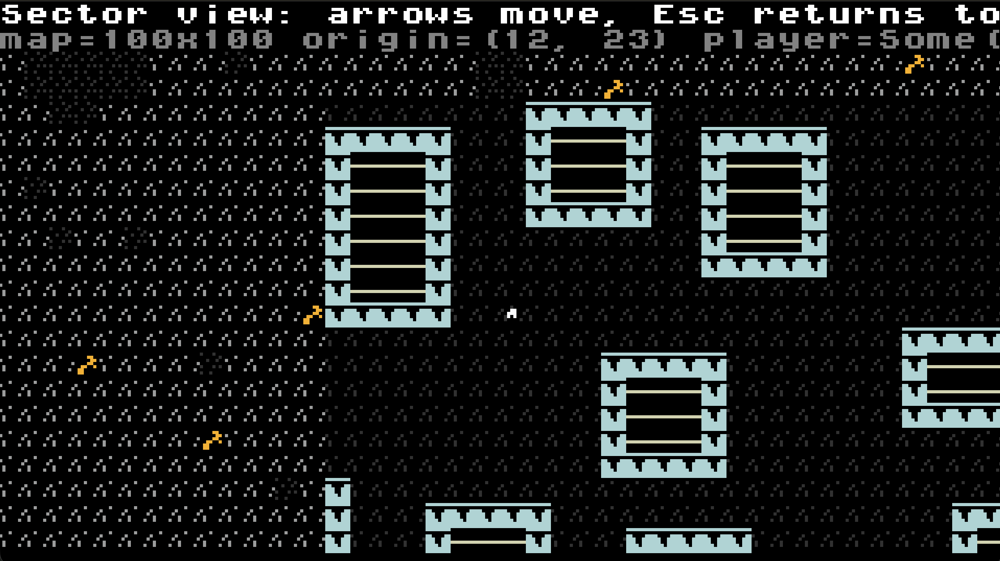

# blastoff

WIP pixel-art roguelike.

## Demo

Currently playable: main menu, galaxy travel, planet landing, overworld movement, sector entry, sprite rendering, and basic in-sector movement. Sector maps are generated with [WFC procgen](src/procgen/sector/wfcgen/mod.rs).

